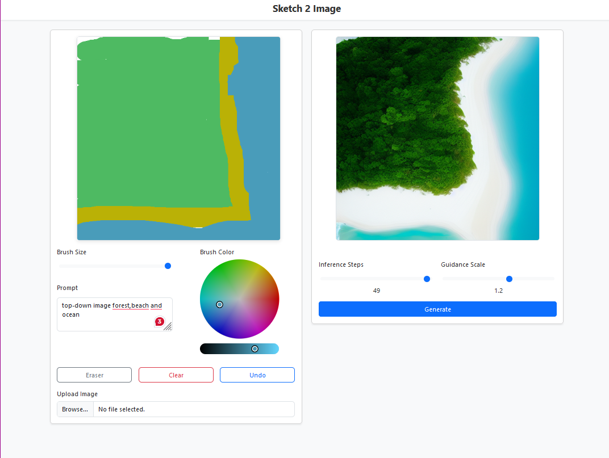

## Drawing Board

This project is an AI-powered drawing board that allows users to create sketches and generate images based on their drawings and prompts using a Stable Diffusion model.




## Features

- Draw on a canvas with different brush sizes and colors
- Upload images to the canvas
- Use an eraser to remove parts of the drawing
- Undo the last action
- Generate images based on the drawing and a text prompt
- Adjust inference steps and guidance scale for image generation

## Installation

1. Clone the repository:
    ```sh
    git clone https://github.com/oliverkristianfritsche/sketch2art.git
    cd sketch2art
    ```

2. Create a virtual environment and activate it:
    ```sh
    python -m venv venv
    source venv/bin/activate  # On Windows use `venv\Scripts\activate`
    ```

3. Install the required packages:
    ```sh
    pip install -r requirements.txt
    ```

## Usage

1. Run the Flask application:
    ```sh
    python routes.py
    ```

2. Open your web browser and go to `http://127.0.0.1:5000`.

## File Structure

- `routes.py`: Contains the Flask routes for the web application.
- `utils.py`: Contains the image processing logic using the Stable Diffusion model.
- `static/js/scripts.js`: Contains the JavaScript code for the front-end interactions.
- `templates/index.html`: Contains the HTML structure of the web application.
- [requirements.txt](http://_vscodecontentref_/0): Lists the required Python packages.
